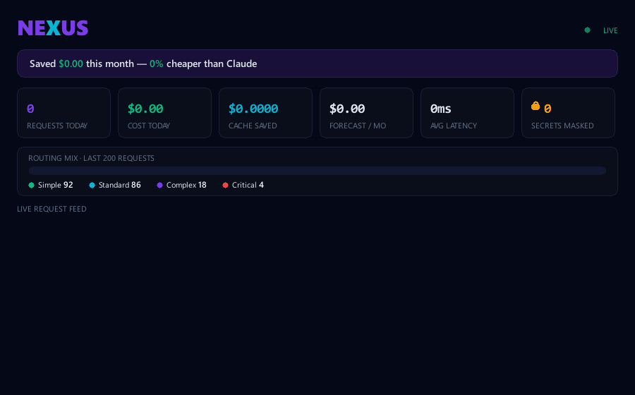

# NEXUS



**The local-first privacy + intelligence layer for Claude Code — and every AI coding tool.**  
NEXUS keeps your code and secrets **on your machine**, **learns** which model wins *your* tasks, **proves** the savings on your *own* traffic — and routes every request to the cheapest capable model. One Go binary. No cloud. No markup.

[](https://github.com/lynuxis2026-pixel/nexus-proxy/releases)
[](https://github.com/lynuxis2026-pixel/nexus-proxy/actions)
[](LICENSE)
[](go.mod)
[](https://github.com/lynuxis2026-pixel/nexus-proxy/stargazers)

> **Not just another "cheap Claude Code" proxy.**  
> OpenRouter routes to the cheapest provider. NotDiamond predicts a model from the crowd's preferences. **NEXUS** is the only one that **learns which provider wins _your_ tasks**, **verifies** the cheap answer before trusting it, **redacts secrets before they ever leave your machine**, and **proves** it by benchmarking every provider on _your own_ traffic — as one local binary, no markup, built for Claude Code.

```bash
curl -fsSL https://raw.githubusercontent.com/lynuxis2026-pixel/nexus-proxy/main/install.sh | sh
nexus start
```

> **NEXUS is running**  
> Proxy: http://localhost:3000  
> Dashboard: http://localhost:2222

```bash
nexus code   # starts NEXUS (if needed) + launches Claude Code through it — one command
```

…or wire it up manually:

```bash
export ANTHROPIC_BASE_URL=http://localhost:3000
export ANTHROPIC_API_KEY=nexus-local
claude  # Claude Code now uses NEXUS
```

---

## Why NEXUS?

Routing Claude Code to cheaper models is a commodity now. NEXUS is built around
the four things no one else does in one local tool:

- **🔒 Private** — a firewall masks API keys, secrets and PII *before* a request leaves for any third-party model, and restores them in the response. Your code and keys never leave your machine. (Cloud gateways structurally can't offer this.)
- **🧪 Proven** — `nexus bench` replays your *real* captured traffic across every provider and shows cost × latency × agreement, so you pick a model by **measuring**, not guessing.
- **🧠 Self-learning** — adaptive routing learns which provider wins *your* task types from real outcomes — not the crowd's generic preferences.
- **📦 Local** — one signed Go binary, pure-Go SQLite. No Python, no Docker, no Postgres, no cloud, no token markup, no supply-chain surface.

…and yes, it cuts the bill — and the savings **compound**: free tiers handle the
simple majority ($0), the cache makes repeats free, off-peak halves the standard
tier, and the cascade keeps premium calls rare.

| Task | Without NEXUS | With NEXUS |
|------|--------------|------------|
| Quick question | Claude Haiku $0.0012 | Groq Llama **$0.00** |
| Code refactor | Claude Sonnet $0.08 | DeepSeek (off-peak) **$0.001** |
| Architecture | Claude Opus $0.45 | Claude Opus $0.45 |
| **Monthly total** (typical heavy user) | **~$240** | **~$7** — **~97% cheaper** |

*Illustrative — your mix differs.* `nexus report` measures your real number and
turns it into one shareable artifact: **$ saved + % cheaper + "N secrets masked
before leaving your machine · 0 leaked."**

---

## What makes NEXUS different

**Single binary** — one `curl | sh`, no Python, no Docker, no config files required.

**Intelligent router** — classifies task complexity before routing. Simple questions go free. Complex architecture stays on Claude.

**Live dashboard** — beautiful real-time UI showing every request, cost, and provider. The first proxy that's actually pleasant to use.

**Zero Claude Code changes** — one env var. That's it.

**Universal gateway** — speaks both the Anthropic API (`/v1/messages`) and the OpenAI API (`/v1/chat/completions`), so Claude Code, Cursor, aider, Continue, Cline, Zed, and any OpenAI SDK app all route through one proxy.

**Cheap-first cascade** — optionally try the cheapest capable model first, verify
its output, and escalate to Claude only when it fails. Real savings, with a safety net.

**Smart cache** — identical requests are served instantly and for free; an opt-in
semantic layer also serves near-identical tool-less prompts.

**Cache-aware costs** — captures provider prompt-cache tokens and shows your true,
cache-discounted spend (and a live "cache saved $X").

**Free-tier key pools** — round-robin across multiple free keys with automatic
429 cooldown, so free tiers behave like one big quota.

**Privacy firewall** — optionally mask secrets, API keys and PII *before* a request
ever leaves for a third-party model, restored transparently in the response.

**Inspect & replay** — click any request in the dashboard to see the full prompt and
response, then replay it against a different provider to compare cost and output.

**Shareable savings** — a live "you saved $X vs. Claude" card you can post anywhere.

---

## Use it with any tool

NEXUS exposes **both** the Anthropic and OpenAI APIs, so point any client at it:

```bash
# Claude Code (Anthropic API)
export ANTHROPIC_BASE_URL=http://localhost:3000
export ANTHROPIC_API_KEY=nexus-local

# Cursor / aider / Continue / Cline / any OpenAI SDK app (OpenAI API)
export OPENAI_BASE_URL=http://localhost:3000/v1
export OPENAI_API_KEY=nexus-local
```

Every request is classified and routed to the cheapest capable provider, cached
when identical, and shown live on the dashboard with its cost. The dashboard's
**Share** button posts your savings card to X in one click.

---

## Install

### macOS / Linux
```bash
curl -fsSL https://raw.githubusercontent.com/lynuxis2026-pixel/nexus-proxy/main/install.sh | sh
```

### Windows (PowerShell)
```powershell
irm https://raw.githubusercontent.com/lynuxis2026-pixel/nexus-proxy/main/install.ps1 | iex
```

### Homebrew
```bash
brew install nexus-proxy/tap/nexus
```

### Build from source
Requires Go 1.22+ (and Node 20+ only if you want to rebuild the dashboard).
```bash
git clone https://github.com/lynuxis2026-pixel/nexus-proxy.git
cd nexus
make build          # builds dashboard + embeds + compiles → bin/nexus
# or, without Node (uses the committed dashboard build):
go build -o bin/nexus ./cmd/nexus
```

### Manual
Download a prebuilt binary from [releases](https://github.com/lynuxis2026-pixel/nexus-proxy/releases).

---

## Add providers

```bash
# Add providers (free first, Claude as fallback)
nexus add groq    YOUR_GROQ_KEY    # free tier — groq.com
nexus add gemini  YOUR_GEMINI_KEY  # free tier — aistudio.google.com
nexus add deepseek YOUR_DEEPSEEK_KEY  # $0.27/1M — deepseek.com

# Or run fully offline
nexus add ollama  # requires Ollama running locally

# Keep Claude for complex tasks
nexus add anthropic YOUR_ANTHROPIC_KEY
```

---

## Routing strategies

NEXUS has 4 routing modes:

```bash
nexus start --strategy auto      # intelligent (default)
nexus start --strategy cheapest  # always cheapest available
nexus start --strategy fastest   # lowest latency
nexus start --strategy manual    # explicit model mapping
nexus start --budget 5           # cap spend at $5/day → free/local only when exceeded
nexus start --cascade            # cheap-first: try cheapest, verify, escalate only on failure
nexus start --adaptive           # learn the best provider per task type from real outcomes
nexus start --semantic-cache     # serve near-identical tool-less requests from cache
nexus start --redact             # privacy firewall: mask secrets/PII before forwarding
nexus start --inspect            # capture prompts/responses for the dashboard inspector + replay
```

**Auto mode** classifies each request:

| Complexity | Routes to | Cost |
|-----------|-----------|------|
| Simple (<200 tokens, no tools) | Groq Llama 3.3 | **Free** |
| Standard (code, refactor, explain) | DeepSeek V3 | **$0.001** |
| Complex (architecture, planning) | Claude Sonnet | $0.05 |
| Critical (security, urgent) | Claude Opus | $0.40 |

---

## Dashboard

Open `http://localhost:2222` after starting NEXUS.

- **Live request feed** — every request in real-time
- **Cost meter** — today / this week / forecast
- **Provider health** — latency and status per provider  
- **Model breakdown** — see which models handle what

---

## CLI reference

```bash
nexus start              # start proxy + dashboard
nexus code               # start NEXUS (if needed) + launch Claude Code through it
nexus add <provider> <key>  # add a provider (key can be "k1,k2,k3" for a pool)
nexus doctor             # diagnose setup, test every provider, suggest fixes
nexus top                # live terminal dashboard (htop for your LLM traffic)
nexus mcp                # run as an MCP server (Claude Code can query your usage)
nexus bench              # benchmark every provider on your real captured traffic
nexus report             # Trust & Savings report (what you saved + what never leaked)
nexus status             # provider health check
nexus models             # show Claude→provider model mapping
nexus logs               # recent requests
nexus cost               # cost breakdown
nexus config             # show config path
nexus version            # show version
```

---

## Supported providers

NEXUS speaks the Anthropic API to Claude Code and translates to each provider's
API under the hood. **30 providers built in** — plus any OpenAI-compatible
endpoint via a custom provider (see below).

| Provider | Add it | Tier |
|----------|--------|------|
| Anthropic | `nexus add anthropic <key>` | Premium |
| OpenAI | `nexus add openai <key>` | Premium |
| xAI (Grok) | `nexus add xai <key>` | Premium |
| DeepSeek | `nexus add deepseek <key>` | Standard |
| Mistral | `nexus add mistral <key>` | Standard |
| Cohere | `nexus add cohere <key>` | Standard |
| Together AI | `nexus add together <key>` | Standard |
| Fireworks | `nexus add fireworks <key>` | Standard |
| OpenRouter | `nexus add openrouter <key>` | Standard |
| DeepInfra | `nexus add deepinfra <key>` | Standard |
| Perplexity | `nexus add perplexity <key>` | Standard |
| Novita | `nexus add novita <key>` | Standard |
| Hyperbolic | `nexus add hyperbolic <key>` | Standard |
| Nebius | `nexus add nebius <key>` | Standard |
| Moonshot (Kimi) | `nexus add moonshot <key>` | Standard |
| Zhipu (GLM) | `nexus add zhipu <key>` | Standard |
| AI21 (Jamba) | `nexus add ai21 <key>` | Standard |
| Lambda | `nexus add lambda <key>` | Standard |
| Baseten | `nexus add baseten <key>` | Standard |
| Featherless | `nexus add featherless <key>` | Standard |
| kluster.ai | `nexus add kluster <key>` | Standard |
| Venice (private) | `nexus add venice <key>` | Standard |
| Friendli | `nexus add friendli <key>` | Standard |
| Chutes | `nexus add chutes <key>` | Standard |
| Groq | `nexus add groq <key>` | Free |
| Gemini | `nexus add gemini <key>` | Free |
| Cerebras | `nexus add cerebras <key>` | Free |
| SambaNova | `nexus add sambanova <key>` | Free |
| NVIDIA NIM | `nexus add nvidia <key>` | Free |
| Ollama | `nexus add ollama` | Local |

`nexus models` shows exactly which model each Claude tier maps to per provider.

### Any OpenAI-compatible endpoint (custom providers)

Point NEXUS at vLLM, LM Studio, LiteLLM, an Azure-style deployment, or any new
API — no code required:

```bash
nexus add myllm sk-xxx --type openai-compatible --base-url https://my-host/v1
```

### Use environment variables for keys

Keep secrets out of the config file:

```toml
[[providers]]
name = "groq"
api_key = "env:GROQ_API_KEY"   # read from $GROQ_API_KEY at runtime
```

### Override model mapping (no rebuild)

Pin which provider model each Claude tier maps to:

```toml
[[providers]]
name = "groq"
[providers.model_map]
"claude-sonnet-4-6" = "llama-3.3-70b-versatile"
"claude-haiku-4-5"  = "llama-3.1-8b-instant"
"default"           = "llama-3.3-70b-versatile"
```

### Off-peak pricing

Some providers (e.g. DeepSeek) discount heavily during an off-peak UTC window.
Tell NEXUS and your cost + savings reflect the real, lower price during that
window (UTC hours; wraps past midnight if start > end):

```toml
[[providers]]
name = "deepseek"
input_per_1m  = 0.27
output_per_1m = 1.10
off_peak_input_per_1m  = 0.135   # ~50% off
off_peak_output_per_1m = 0.55
off_peak_start_utc = 16
off_peak_end_utc   = 0           # 16:00 → 00:00 UTC
```

### Automatic failover

If a provider returns `429` or a `5xx`, NEXUS transparently fails over to the
next provider in the routing chain — so a rate-limited free tier never breaks
your session. A background health check probes every provider on an interval and
skips ones that are down (they recover automatically).

### Daily budget cap

```bash
nexus start --budget 5        # or set routing.daily_budget_usd in config.toml
```

Once today's spend hits the cap, NEXUS routes only to **free/local** providers
for the rest of the day — premium models resume tomorrow.

**Budget alerts** — point NEXUS at a Slack/Discord/generic webhook and it pings
you when you cross a threshold and when you exceed the budget:

```bash
nexus start --budget 5 --alert-webhook https://hooks.slack.com/services/...   # --alert-threshold 0.8
```

---

## Squeeze costs even further

Four extra layers that stack on top of routing — together they can cut the bill
another **5–10×**:

### 🪜 Cheap-first cascade

```bash
nexus start --cascade        # or routing.cascade = true
```

Instead of sending hard tasks straight to Claude, NEXUS tries the **cheapest
capable model first**, verifies its output (non-empty answer + valid tool-call
JSON), and **escalates to a stronger model only when the cheap one fails**.
Most "standard" work succeeds on a free/cheap model; only the genuine failures
cost premium money. Critical/security requests stay premium-first — never gambled
on a weak model.

### 🧠 Adaptive routing (learns your best provider)

```bash
nexus start --cascade --adaptive
```

NEXUS records whether each provider produced a usable answer for each task type
(reusing the cascade's verification — no extra cost) and **reorders routing to
try the historically-best provider first**. The more you use it, the better it
routes — no manual tuning.

### 🧠 Cache-aware cost tracking

Agentic coding re-sends the same big prefix (system prompt + tools + project
context) every turn. Providers cache it — Anthropic at 0.1×, DeepSeek/OpenAI
similarly — and NEXUS now **captures those cache tokens** (`cache_read` /
`cache_creation`, `prompt_cache_hit_tokens`, `cached_tokens`), prices them at the
real discount, and shows a live **"cache saved $X"** number on the dashboard. You
finally see your true (much lower) cost.

### 🔁 Semantic + normalized cache

```bash
nexus start --semantic-cache [--semantic-threshold 0.95]
```

The response cache now ignores response-irrelevant fields (metadata,
`cache_control` markers) so retries hit, and — opt-in — serves **near-identical
tool-less requests** from cache using a local embedding match (no network, no
deps). Tool calls are never served approximately.

### 🗝️ Free-tier key pools

```bash
nexus add groq "key1,key2,key3"     # comma-separated → rotating pool
```

```toml
[[providers]]
name = "groq"
api_keys = ["env:GROQ_KEY_1", "env:GROQ_KEY_2"]
```

Free tiers are rate-limited, not metered. NEXUS round-robins across a pool of
keys and puts any key that returns `429` on a short cooldown — so several free
keys behave like **one larger free quota**, and a lot more traffic stays at $0.

---

## Power tools

### 🔒 Privacy firewall

```bash
nexus start --redact     # or routing.redact = true
```

Detects API keys (`sk-`, `sk-ant-`, `gsk_`, `AIza`, AWS `AKIA…`, GitHub `ghp_`…),
JWTs, private-key blocks, `KEY=secret` assignments and emails in your prompt and
replaces them with reversible placeholders, so **secrets never reach a third-party
LLM**. The originals are restored in the response (even across streaming chunks),
so masking is invisible to you and to Claude Code's file edits.

### 🔍 Inspect & replay

```bash
nexus start --inspect    # or routing.inspect = true  (stored locally only)
```

Captures the full prompt + response for each request. In the dashboard, click any
row to inspect it, then **replay it against any provider** to compare cost and
output side-by-side. You can also pin any single request to a provider with the
`X-Nexus-Provider` request header.

### 🩺 nexus doctor

```bash
nexus doctor
```

Loads your config, **auto-discovers provider keys from your environment**
(`GROQ_API_KEY`, `OPENAI_API_KEY`, …), health-checks every provider with latency,
and reports actionable checks. NEXUS also picks those env keys up automatically at
`nexus start`, so if you already have keys exported, it just works — zero config.

### 📺 nexus top

```bash
nexus top                # reads the dashboard API; --once for a single frame
```

A live, dependency-free terminal dashboard — requests, cost, cache savings,
providers and a color-coded request feed — for when you don't want a browser.

### 🧪 Benchmark on your real traffic

```bash
nexus bench                       # replays your last N captured requests at every provider
nexus bench --prompt "refactor this function"   # or benchmark a single ad-hoc prompt
```

With `--inspect` history, `nexus bench` replays your **actual** requests against
every provider and prints a cost × latency × output-tokens × *agreement* table
(agreement = how close each provider's output is to your original), then
recommends the cheapest provider that stays close. Stop guessing which model to
use — measure it on your own traffic.

### 🧩 Routing rules + 🛡️ cost guardrail

Declare routing overrides in `config.toml` — no rebuild:

```toml
[[rules]]
when_prompt_contains = "production"   # never gamble prod work
use_tier = "premium"

[[rules]]
when_model_contains = "haiku"
use_provider = "groq"                 # pin trivial calls to a free provider
```

A rule matches when **all** its `when_*` conditions hold (`when_model_contains`,
`when_prompt_contains`, `when_complexity`, `when_has_tools`) and then pins the
request to `use_provider` or `use_tier`.

And cap the cost of any single request — anything estimated above the cap is
automatically downgraded to a free/local model:

```bash
nexus start --max-request-usd 0.50    # or routing.max_request_usd
```

### 🤝 Use with agent harnesses (ECC, …)

NEXUS lives *under* your harness, so it stacks with agent-capability toolkits
like [ECC](https://github.com/affaan-m/ECC): install ECC in Claude Code, point
the harness at NEXUS (`nexus code`), and every skill/subagent call is routed,
cached, cost-tracked and privacy-firewalled. For per-skill routing, NEXUS honors
two headers a harness hook can set:

```
X-Nexus-Tier: premium     # pin this call to premium (architecture, security)
X-Nexus-Tier: free        # pin to free (lint, format, commit messages)
X-Nexus-Provider: groq    # pin to one provider
```

Full guide: **[docs/agent-harnesses.md](docs/agent-harnesses.md)**.

### 👥 Team mode

Point a whole team at one NEXUS and they automatically share its response cache
(everyone benefits from each other's hits). Attribute usage per person — either
by setting a header, or by giving each dev a `nexus-<name>` key:

```bash
export ANTHROPIC_API_KEY=nexus-alice   # or send an X-Nexus-User: alice header
```

The dashboard then shows a **team savings leaderboard** ("alice saved $42 this
month"). No accounts, no setup — just a shared proxy.

### 🧩 MCP server

```bash
claude mcp add nexus -- nexus mcp     # then ask Claude: "how much did I save today?"
```

NEXUS speaks the **Model Context Protocol** over stdio, exposing tools
(`nexus_stats`, `nexus_savings`, `nexus_recent`, `nexus_providers`,
`nexus_cost_breakdown`) so Claude Code — or any MCP client — can read your usage
and savings directly in chat.

---

### Enterprise providers (Azure, Bedrock, Vertex)

```bash
# Azure OpenAI (api-key auth, deployment endpoint)
nexus add azure "$AZURE_KEY" --type azure \
  --base-url https://my-res.openai.azure.com/openai/deployments/gpt-4o --api-version 2024-10-21

# AWS Bedrock (SigV4 — reads AWS_ACCESS_KEY_ID / AWS_SECRET_ACCESS_KEY from env)
nexus add bedrock --type bedrock --region us-east-1

# Google Vertex AI (bearer access token)
nexus add vertex "env:GCP_TOKEN" --type vertex --region us-east5 --project my-project
```

Bedrock and Vertex speak Claude's native Messages API; Azure uses the OpenAI
format. Streaming works for all providers — OpenAI-compatible ones are converted
token-by-token, Bedrock/Vertex are buffered then re-streamed.

All three accept an optional `--base-url` to route through a gateway, VPC
endpoint, or local proxy. That's also how NEXUS integration-tests them offline —
the full URL / auth (SigV4, bearer, api-key) / body-transform / response path is
verified in CI against an in-process server, with no cloud account required.

---

## How it works

```
Claude Code → NEXUS Proxy → Classifier → Router → Provider
                               ↓
                          SQLite log
                               ↓
                        Dashboard (SSE)
```

NEXUS intercepts every Claude Code request at `POST /v1/messages`. The classifier analyzes the prompt complexity, the router picks the best available provider, and the response is transformed back to Anthropic format — invisible to Claude Code.

---

## Configuration

Config is stored at `~/.nexus/config.toml`. NEXUS works with zero config — just add providers.

```toml
[proxy]
port = 3000

[dashboard]
port = 2222

[routing]
strategy = "auto"

[[providers]]
name = "groq"
api_key = "gsk-..."
tier = "free"
```

---

## Develop from anywhere — even your phone 📱

This repo ships a `.devcontainer/`, so you can build NEXUS in a **GitHub Codespace**
straight from your phone (Go, Node and Claude Code come preinstalled). Open the repo
on github.com → `Code → Codespaces → Create`, then run `claude` in the terminal and
keep building. Full guide: **[docs/MOBILE.md](docs/MOBILE.md)**.

---

## FAQ

**Isn't this just claude-code-router / OpenRouter?**
Routing to cheaper models is the commodity part — yes, NEXUS does it. The
difference is everything around it: a **privacy firewall** that masks secrets/PII
before they leave your machine, **`nexus bench`** that proves which cheap model is
good enough on *your own* traffic, **adaptive routing** that learns *your* best
provider per task, and a **local single binary** with no cloud and no token markup.

**Is my code/data safe?**
NEXUS runs entirely on your machine. The only thing that leaves is the LLM call to
the provider *you* configured — and with `--redact` on, detected secrets/PII are
masked before that call and restored in the response. No telemetry, no cloud, your
keys stay in your local config/env. Want zero egress? Route to Ollama and stay
fully offline.

**Won't cheap models produce worse code?**
That's the point of the **cheap-first cascade**: it tries the cheap model, verifies
the output (valid tool-call JSON / non-empty), and **escalates to Claude on
failure**. Complex/critical tasks start premium. And `nexus bench` lets you measure
agreement on your real prompts before trusting a model.

**Does it work with Cursor / aider / Cline?**
Yes. NEXUS speaks **both** the Anthropic (`/v1/messages`) and OpenAI
(`/v1/chat/completions`) APIs, so any of them route through it with one env var.

**Do you take a cut or see my keys?**
No markup, no cloud, no account. Your provider keys live in `~/.nexus/config.toml`
(or `env:` refs) on your machine.

**How does it decide where to route?**
It classifies each request's complexity → tier, with optional cheap-first cascade
and adaptive learning. You can override per request (`X-Nexus-Tier` /
`X-Nexus-Provider` headers) or declaratively (`[[rules]]` in config).

---

## Contributing

PRs welcome. See [CONTRIBUTING.md](CONTRIBUTING.md).

Areas that need help:
- More provider integrations
- Dashboard components (Svelte)
- Better complexity classification
- Windows testing

---

## License

**[Apache License 2.0](LICENSE)** — free to use, modify and redistribute, with
two protections that MIT doesn't give you:

- **Trademark protection** (Apache-2.0 §6 + [`NOTICE`](NOTICE)): forks and
  derivatives may not be distributed under the "NEXUS" name or logo.
- **Patent grant + retaliation**: contributors grant patent rights, and lose
  them automatically if they sue.

The full strategy — including the optional source-available (BSL 1.1) path for
newer versions — is in **[docs/LICENSING.md](docs/LICENSING.md)**. There is
also a runtime [`internal/license`](internal/license/) package that lets future
builds gate features per edition; today every feature is unlocked and
`nexus version` says so explicitly.

---

*Built by someone tired of watching Claude API credits disappear.*
